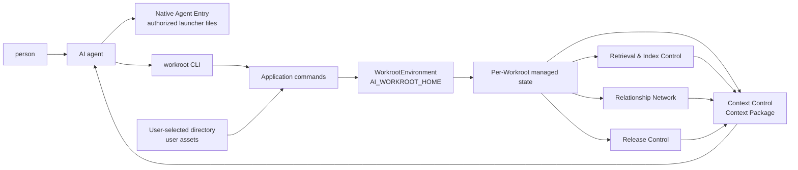
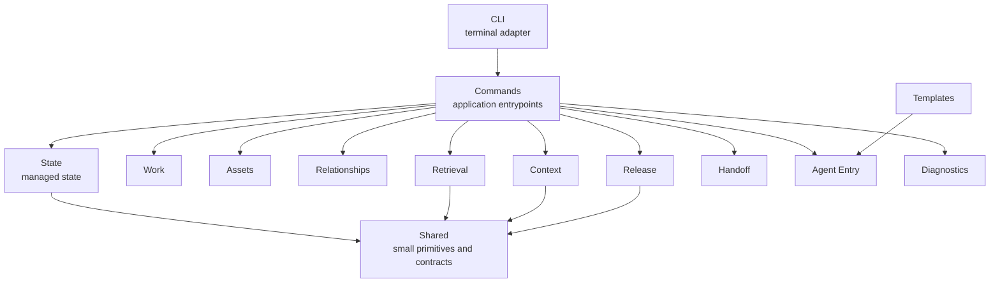
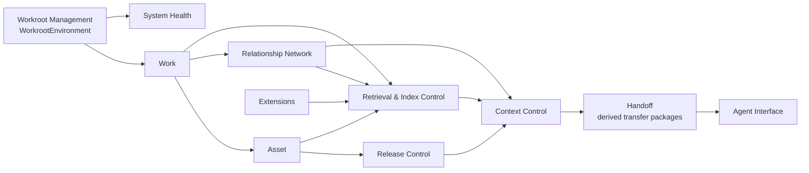
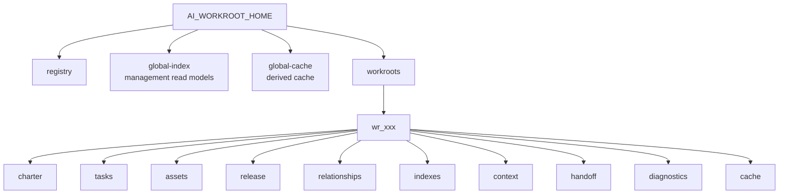
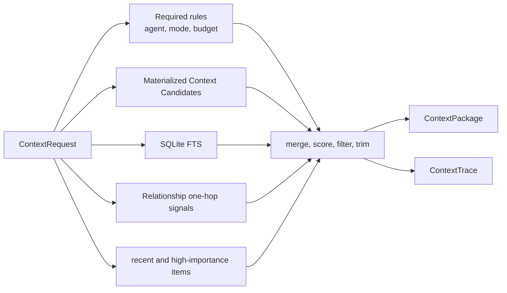
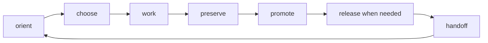

# Architecture Map

AI Workroot separates user assets, WorkrootEnvironment management, runtime orchestration, storage, indexing, agent entry, and release controls so AI work can continue across agents, models, tools, operating systems, and time.

The active architecture is Clean Workroot:

```text
user-selected directory   user assets, optional authorized Native Agent Entry
AI_WORKROOT_HOME          WorkrootEnvironment and managed state
src/ai_workroot/          CLI / Commands / Capability Modules / Shared / Templates
```

Public Seed is historical and lives under `docs/history/public-seed/` only.

## Core Product Flow



## Engineering Layers



The historical Agent Operation Layer is preserved through explicit capability mapping. Clean Workroot maps it into CLI, Commands, Work, Context Control, Handoff, and Agent Interface capabilities instead of requiring active Public Seed root files.

## Domain Concepts



Domain arrows describe product flow and references between capabilities, not source import dependencies.

## Managed State Layout



## Context Loading



## Daily Loop



## Rule

Ordinary users should not need this map before they get value.

Agents and contributors use the map to keep user directories clean, managed state explicit, context explainable, release controls enforceable, and legacy Public Seed material safely historical.
