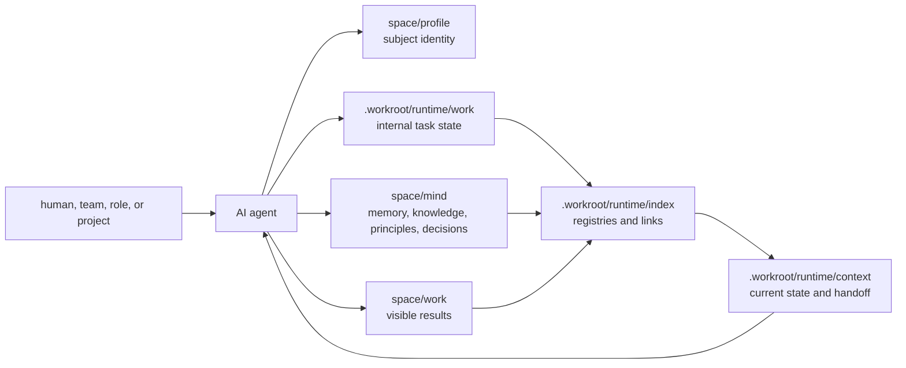
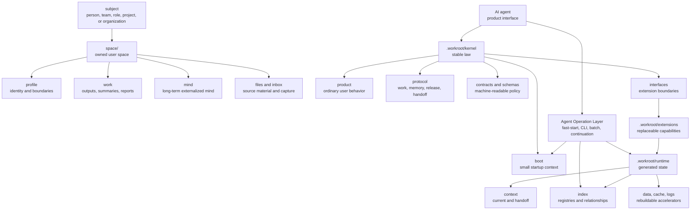
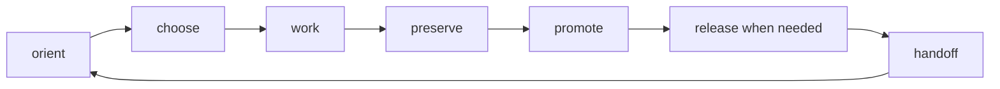
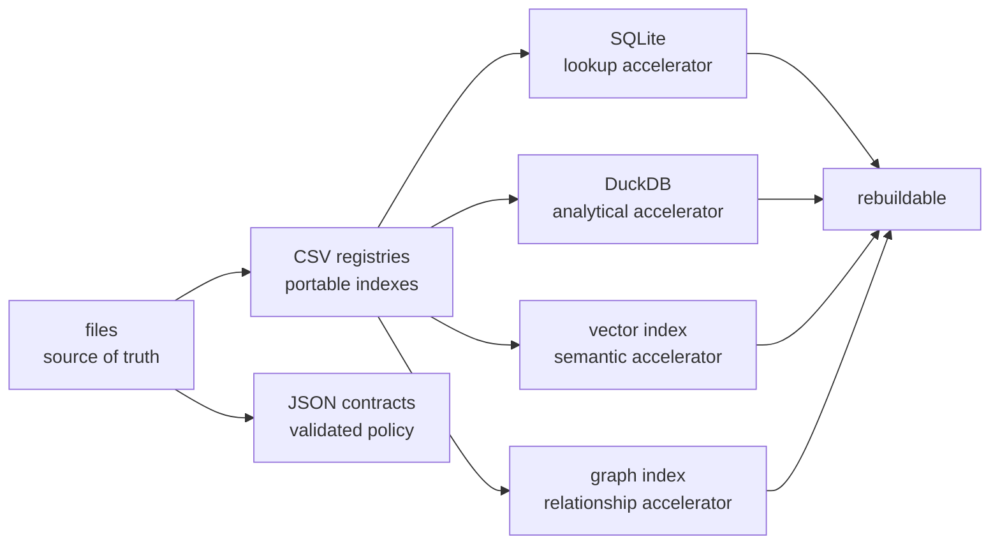

# Architecture Map

AI Workroot separates user work, kernel law, extensions, runtime state, indexes, and handoff so that AI work can continue across agents, models, tools, operating systems, and time.

The public architecture is:

```text
space/       user-visible workspace
.workroot/   kernel, extensions, and rebuildable runtime state
```

## Core Product Flow



## Operating Layers



## Daily Loop



## Context Loading


## Storage Principle



## Rule

Ordinary users should not need this map before they get value.

Agents and contributors use the map to keep the product simple, the kernel strict, context small, generated stores rebuildable, and future continuation reliable.
