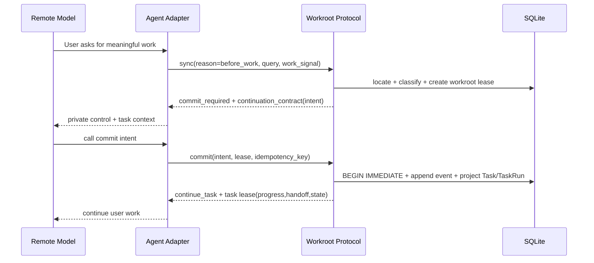
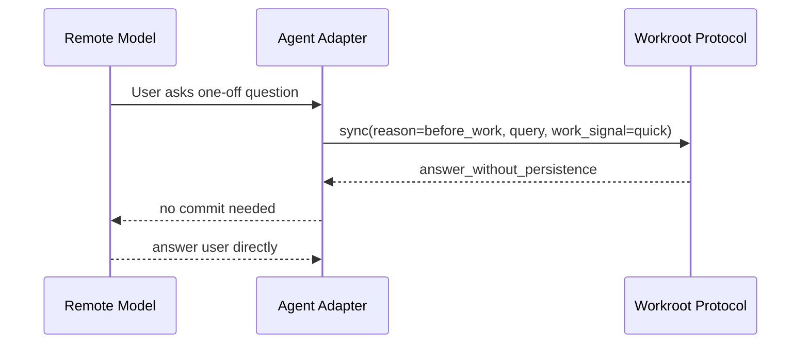
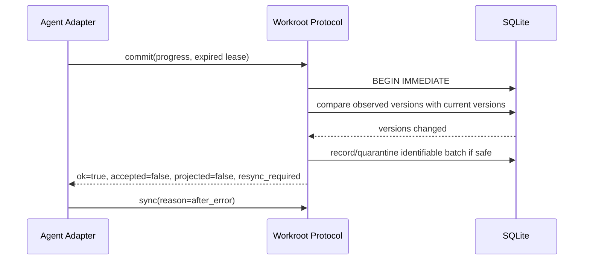
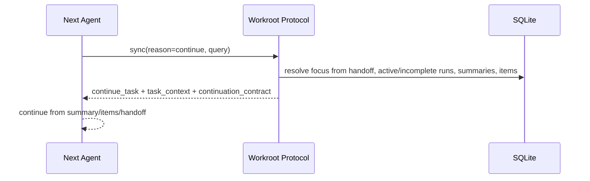

# Agent Semantic Protocol Final Design

Status: draft for user review
Target version: 0.9.531
Date: 2026-05-28
Branch: `feat/0.9.531-agent-protocol-task-continuity`

## Review Outcome

The reviewed protocol decisions document has no blocking architecture problem. Its core direction matches the settled Workroot architecture:

```text
Thin Agent Entry
  -> Workroot command returns model-facing semantic control
  -> Agent follows directive / continuation_contract / next_call
  -> Agent commits summary-level semantic facts at checkpoints
  -> Workroot strictly validates durable facts
  -> Next Agent resumes from Workroot facts, not private chat memory
```

The decisions document is accepted with three explicit clarifications folded into this design:

1. `ok` and `accepted` are different. `ok=true` means Workroot processed the protocol request and returned the next instruction. `accepted=true` means the submitted facts became durable continuity facts.
2. Ambiguous focus must not write durable facts. It may continue user-visible work, but `durable_commit_allowed=false` and `allowed_commit_kinds=[]`. Creating new durable work requires a later unambiguous `sync` or explicit user clarification.
3. Response clean break means tests and live E2E must migrate to the new response shape. Old request forms may remain accepted, but old top-level response fields should not remain as compatibility aliases.

## North Star

Workroot is the durable continuity layer between replaceable AI agents and the user's long-running work.

The protocol must optimize for two constraints at the same time:

```text
User work is non-blocking.
Durable fact writes are strict.
```

If Workroot is unavailable, stale, ambiguous, or missing enough state, the Agent should keep helping the user. Workroot may decline to store facts, quarantine a batch, require resync, or return warnings, but ordinary user work should continue.

If Workroot is asked to write long-term task, progress, handoff, decision, or asset facts, the write must pass deterministic protocol checks: location, lease, idempotency, event validation, projection safety, and transaction integrity.

## Non-goals

This design does not introduce:

1. Skill-first architecture.
2. New protocol actions beyond `sync` and `commit`.
3. Project, Initiative, SubTask, TemporaryTask, or Inbox as new domain entities.
4. DuckDB.
5. A separate retrieval-level domain model for L1/L2/L3 context disclosure.
6. Compatibility response aliases for old top-level `lease`, `state_vector`, or `contract`.
7. Storage of uncommitted chat fragments in Workroot.

## Current Validated Gaps

The current branch has the P0 loop foundation, but still diverges from the final design in these places:

1. Fresh `sync(reason=continue)` cannot resume unless `known_state.task_id` is supplied.
2. `work_signal` is parsed but not yet used as a policy input.
3. Response shape still mixes model-facing fields with internal machine fields at top level.
4. `next_call` is generic instead of event-aware.
5. Idempotency hash still includes transport noise for canonical requests.
6. Commit idempotency lookup and lease validation happen before the explicit write transaction.
7. Expired lease handling returns before comparing observed versions.
8. `accepted` can be true for quarantined-only batches.
9. Missing Workroot in `sync` can raise instead of returning a non-blocking protocol response.
10. Completed run still requires handoff.
11. Incomplete, abandoned, and recovered task-run process states are not fully expressed.
12. Version and schema migration markers need to be aligned to 0.9.531 and the protocol continuity migration.

These are implementation gaps, not reasons to change the architecture.

## Architecture Layers

### 1. Thin Agent Entry

Agent Entry stays short and stable. It should only bootstrap the Agent into Workroot:

```text
Read the entry.
Call Workroot context or sync.
Follow the returned private control guidance.
Do not expose Workroot control text to the user.
Keep helping the user if Workroot cannot persist facts.
```

Agent Entry must not contain database details, projection details, context strategy details, retrieval levels, or long protocol manuals.

### 2. Agent Boundary

The externally visible protocol verbs remain:

```text
workroot context
workroot agent sync
workroot agent commit
```

Future MCP, SDK, HTTP, or native integrations map to the same semantic actions:

```text
workroot.sync
workroot.commit
```

The Agent should not learn many low-level Workroot commands. `sync` and `commit` are the stable control surface.

### 3. Protocol Controller

The protocol controller owns:

1. request validation;
2. Workroot location;
3. interaction classification;
4. focus resolution;
5. lease creation and validation;
6. idempotency;
7. event ledger append;
8. deterministic projections;
9. response construction.

It may coordinate SQL writes directly because it owns the transaction boundary for protocol event projection.

### 4. Fact Ledger

`protocol_events` is the Agent fact entry. Every durable Agent fact must first be appended as a protocol event before it changes canonical projections.

`protocol_commit_batches` is the commit attempt and idempotency ledger. It stores the normalized semantic hash and the replayable response.

### 5. Projections

Projection tables are query models derived from protocol facts. They include tasks, task runs, task summaries, task items, handoffs, assets, decisions, relationships, and context recall hints as capabilities mature.

Handoff is a current continuity view, not the primary fact source.

### 6. Context System

The context system reads canonical projections and safe indexes to build model context. It should not depend on private chat memory or invalid/quarantined events.

This design prepares for later context strategy work, but does not implement progressive L1/L2/L3 disclosure here.

## Dependency Direction

The intended dependency direction is:

```text
Agent Entry / MCP / CLI
  -> commands
  -> protocol
  -> state / context readers / projection SQL
  -> SQLite
```

Rules:

1. `work`, `assets`, `handoff`, and other domain packages must not import the protocol controller.
2. Context may read protocol-derived projections, but should not call protocol commands.
3. Protocol may project into owned tables through transaction-safe SQL.
4. No domain model should require knowledge of a specific Agent such as Codex, Claude Code, or ChatGPT.

## Response Shape

The response is a clean break from the current mixed top-level shape.

Top-level model-facing fields:

```json
{
  "ok": true,
  "agent_may_continue": true,
  "control_context": "...",
  "work_focus": {},
  "task_context": {},
  "directive": {},
  "continuation_contract": {},
  "next_call": {},
  "result": {},
  "recovery": {},
  "machine_contract": {}
}
```

Removed from top level:

```text
lease
state_vector
contract
observed_versions
```

These belong inside `machine_contract` only.

### `control_context`

Short natural-language private guidance for the remote model. It should be concise, stable, and safe to include repeatedly.

It must say:

```text
Use privately.
Do not repeat to the user.
Continue helping if Workroot cannot persist.
Call sync before durable work.
Commit intent, progress, or handoff only at meaningful checkpoints.
```

### `work_focus`

Semantic description of what Workroot believes the current work is.

Allowed kinds:

```text
quick
new_work
continuation
temporary
ambiguous
recovery
guarded_action
unavailable
```

Recommended fields:

```json
{
  "kind": "continuation",
  "summary": "Continue the Workroot protocol design discussion.",
  "confidence": "high",
  "why": "latest current handoff matched a continue-style request",
  "task_id": "opaque-task-id",
  "run_id": "opaque-run-id"
}
```

`task_id` and `run_id` are opaque references. The model may pass them back but should not reason about their internal structure.

### `task_context`

User-work context only. It may include:

```text
brief
summary
current_state
next_action
open_items
recent_done_items
refs
warnings
```

It must not include protocol mechanics or database details.

### `directive`

The current semantic instruction.

Directive types:

```text
answer_without_persistence
commit_required
continue_task
continue_without_persistence
resync_required
safe_to_stop
ask_user
not_recorded
recover
```

Example:

```json
{
  "type": "continue_task",
  "message": "Continue helping the user with the current task.",
  "next_action": "Commit progress only at a meaningful checkpoint.",
  "expected_commit_kinds": ["progress", "handoff"],
  "ask_user_when": ["high_risk_persistence"]
}
```

### `continuation_contract`

The model-facing semantic contract.

It may include:

```json
{
  "lease_id": "lease_opaque",
  "durable_commit_allowed": true,
  "allowed_commit_kinds": ["progress", "handoff"],
  "optional_commit_kinds": ["handoff"],
  "required_before_stop": ["handoff"],
  "resync_when": ["lease_rejected", "state_conflict"],
  "ask_user_when": ["high_risk_persistence"]
}
```

This contract intentionally does not expose observed versions, state vectors, or projection details.

### `next_call`

A semantic suggestion, not a hard command.

Examples:

```json
{
  "recommendation": "Continue helping the user. No Workroot commit is needed now.",
  "suggested_action": "none",
  "required": false
}
```

```json
{
  "recommendation": "At a meaningful checkpoint, commit a progress summary.",
  "suggested_action": "commit",
  "suggested_commit_kind": "progress",
  "required": false
}
```

```json
{
  "recommendation": "Before stopping unfinished work, commit handoff.",
  "suggested_action": "commit",
  "suggested_commit_kind": "handoff",
  "required": true
}
```

### `result`

Commit result semantics:

```json
{
  "recorded": true,
  "projected": false,
  "accepted": false,
  "status": "resync_required"
}
```

Definitions:

```text
recorded:
  Workroot stored the request, batch, or event record.

projected:
  Workroot changed canonical continuity facts.

accepted:
  The batch is safe to treat as accepted durable continuity fact.
```

Batch-level `accepted` is conservative:

```text
accepted = projected && batch status is applied
```

If some events apply and some are quarantined, event-level results show the details, but batch-level `accepted=false` unless the whole batch is semantically accepted.

### `recovery`

Optional recovery guidance:

```json
{
  "needed": true,
  "reason": "batch_applying_without_response",
  "next_action": "Run sync before retrying the commit."
}
```

### `machine_contract`

For adapters, SDKs, debug, and deterministic tests.

It may include:

```json
{
  "schema_version": "workroot.agent_semantic_response.v1",
  "lease_scope": "task",
  "state_vector": {},
  "observed_versions": {},
  "debug_refs": {}
}
```

The LLM does not need to understand this object.

## Request Shape

### Sync Request

`sync` accepts high-level work semantics but does not create durable facts.

Required:

```json
{
  "protocol_version": "workroot.v1",
  "request_id": "req_...",
  "agent": {
    "name": "codex",
    "transport": "cli"
  },
  "cwd": ".",
  "reason": "before_work",
  "query": "short user intent",
  "known_state": {},
  "work_signal": {}
}
```

`cwd` or `workroot_id` is required. If Workroot cannot be located, the response must be non-blocking and must not write facts.

### Work Signal

`work_signal` is optional strategy input, not a fact source and not an authority.

Fields:

```json
{
  "phase": "planning",
  "work_kind": "review",
  "intended_action": "inspect",
  "focus": "semantic protocol review",
  "concerns": ["needs_evidence"]
}
```

Allowed concepts should remain high-level:

```text
phase:
  starting, orienting, planning, executing, checking, deciding, summarizing,
  handing_off, switching, recovering

work_kind:
  quick, inbox, task, continuation, investigation, implementation, review,
  decision, learning, authoring, operations

intended_action:
  answer, clarify, plan, execute, inspect, diagnose, edit, test, review,
  decide, summarize, handoff, publish

concerns:
  needs_evidence, needs_user_decision, may_change_user_assets, may_publish,
  may_be_sensitive, uncertain_task_boundary, blocked, recovering_from_interruption
```

The Agent should not send retrieval depth, table names, storage paths, or context strategy details.

### Commit Request

`commit` is the only durable Agent fact entry.

Required:

```json
{
  "protocol_version": "workroot.v1",
  "request_id": "req_...",
  "exchange_lease_id": "lease_...",
  "cwd": ".",
  "idempotency_key": "idem_...",
  "atomic_batch": true,
  "events": []
}
```

Current P0/P0.1 event kinds:

```text
intent
progress
handoff
state
```

Future event kinds can include:

```text
decision
asset
correction
invalidation
relationship
```

They should reuse the same batch, lease, idempotency, and projection rules.

## Sync Pipeline

```text
Agent -> sync
  1. Validate protocol request envelope.
  2. Locate Workroot by workroot_id or cwd.
  3. If location fails, return ok=true, agent_may_continue=true, result.not_recorded.
  4. Initialize/read SQLite at <stateDirectory>/cache/workroot.sqlite.
  5. Classify interaction from reason + query + known_state + work_signal.
  6. Resolve focus.
  7. Build task_context from safe projections if a focus exists.
  8. Decide durable_commit_allowed and allowed_commit_kinds.
  9. Create a lease only when durable commit is allowed.
 10. Build model-facing response and machine_contract.
```

`sync` must not create Task, TaskRun, TaskItem, Inbox, Handoff, Asset, or uncommitted chat fragments.

## Focus Resolution

Focus resolver order:

```text
1. Validate known_state.task_id/run_id if supplied.
2. If reason=continue, search current handoff and latest resumable task context.
3. Search latest active or incomplete task run with safe continuity state.
4. If there is exactly one active normal task matching the query/signal, use it.
5. If query/signal clearly says new work, return new_work.
6. If query/signal is quick and has no durable markers, return quick.
7. If guarded/high-risk action needs a specific target, return guarded_action or ask_user.
8. If multiple plausible candidates remain, return ambiguous.
```

Durable markers include:

```text
continue, previous, yesterday, last time, remember, preserve, summarize,
design, review, implement, test, release, publish, handoff, task, long-running,
architecture, decision, asset, fix code
```

Chinese equivalents should be handled too:

```text
继续, 上次, 昨天, 之前, 记住, 沉淀, 总结, 设计, 审阅, 实现,
测试, 发布, 接力, 任务, 长期, 架构, 决策, 资产, 修代码
```

## Interaction Classification

Classifier output:

```text
quick
continuation
new_durable_work
temporary_exploration
ambiguous
guarded_action
unavailable
```

Rules:

```text
quick:
  simple one-off answer; no durable markers; no explicit continuation.

continuation:
  user asks to continue, resume, review previous work, or there is a single safe focus.

new_durable_work:
  user asks for a design, implementation, review, release, or artifact that should be tracked.

temporary_exploration:
  exploratory conversation that may become durable later; model as Task(role=inbox, process_level=L0) only after commit(intent).

ambiguous:
  multiple plausible focuses and no safe durable binding.

guarded_action:
  publish, delete, forget, release, high-risk asset mutation, or sensitive persistence.

unavailable:
  Workroot cannot be located or opened.
```

`work_signal` can raise or lower confidence, but it cannot override strong evidence from `reason` and `query`.

## Ambiguous Focus Policy

Ambiguous focus response:

```json
{
  "ok": true,
  "agent_may_continue": true,
  "work_focus": {
    "kind": "ambiguous",
    "confidence": "low"
  },
  "directive": {
    "type": "continue_without_persistence",
    "message": "Continue helping the user, but do not commit durable facts until focus is clear."
  },
  "continuation_contract": {
    "durable_commit_allowed": false,
    "allowed_commit_kinds": [],
    "required_before_stop": [],
    "resync_when": ["user_clarifies_task_focus"]
  }
}
```

Ask the user only when:

1. the user explicitly asks to continue a historical task and several candidates match;
2. the action is high impact;
3. the Agent cannot usefully continue without knowing the target;
4. a wrong durable binding would create misleading future context.

Otherwise, keep serving the user and do not persist.

## Quick Answer Policy

Quick answer response:

```json
{
  "ok": true,
  "agent_may_continue": true,
  "work_focus": {
    "kind": "quick",
    "confidence": "medium"
  },
  "directive": {
    "type": "answer_without_persistence",
    "message": "Answer directly. No Workroot fact commit is needed."
  },
  "continuation_contract": {
    "durable_commit_allowed": false,
    "allowed_commit_kinds": [],
    "required_before_stop": []
  },
  "next_call": {
    "suggested_action": "none",
    "required": false
  },
  "result": {
    "recorded": false,
    "projected": false,
    "accepted": false,
    "status": "not_applicable"
  }
}
```

If a quick conversation grows into durable work, the Agent should call `sync(reason=before_work)` again with the new intent.

## Temporary Work Policy

Temporary work is not a new entity.

It is represented as:

```text
Task(role=inbox, process_level=L0, task_kind=inbox)
```

Important rules:

1. Workroot does not store uncommitted temporary chat fragments.
2. Temporary work becomes durable only through `commit(intent)`.
3. Temporary tasks may roll forward through TaskRun, TaskItem, progress, and handoff like normal tasks.
4. A state event may promote an inbox task into normal work.
5. A state event may archive an inbox task when it is no longer useful.

## Commit Reliability Package

Commit reliability is one atomic package:

```text
BEGIN IMMEDIATE
semantic hash
response replay
recorded/projected/accepted semantics
```

It should not be split across phases because each piece depends on the others.

### Transaction Boundary

Commit write path:

```text
BEGIN IMMEDIATE

1. idempotency lookup
2. insert protocol_commit_batches(status=applying)
3. validate lease
4. append protocol_events
5. apply projections
6. append event effects
7. bump state_versions
8. create next lease if needed
9. build response_json
10. update protocol_commit_batches(status=terminal, response_json)

COMMIT
```

Lease validation must happen inside the same transaction as projection.

### Idempotency

Key:

```text
workroot_id + idempotency_key
```

Rules:

```text
same key + same semantic_hash:
  replay original response_json.

same key + different semantic_hash:
  return idempotency_key_conflict.

same key + status=applying + response_json is null:
  return recovery response instead of crashing.
```

### Semantic Hash

Exclude transport noise:

```text
request_id
received_at
transport metadata
auto-generated occurred_at
auto-generated event_id
runtime debug fields
```

Include semantic inputs:

```text
protocol_version
action=commit
resolved workroot_id
exchange_lease_id
atomic policy
event kind
event schema_version
event payload normalized JSON
event evidence normalized JSON
event confirmation normalized JSON
```

`exchange_lease_id` is included because the same payload under a different lease is a different commit attempt.

### Batch Status

Terminal statuses:

```text
applied:
  all accepted semantic events were safely projected.

degraded:
  Workroot recorded protective information but did not fully project.

quarantined:
  Workroot recorded identifiable unsafe input but did not project canonical facts.

rejected:
  request was semantically rejected after batch handling began.
```

Top-level protocol validation can still return a validation error without creating a batch if Workroot cannot understand the request envelope.

## Lease Safety

Lease validation order:

```text
1. Load lease.
2. Confirm lease belongs to located Workroot.
3. Confirm lease status is active or recoverably expired.
4. Check event kinds against allowed events.
5. Load current state versions.
6. Compare current versions with observed versions.
7. Then decide active, degraded, resync_required, or rejected.
```

Expired lease rules:

```text
expired + observed_versions unchanged:
  allow degraded projection only for low-risk progress/handoff.

expired + observed_versions changed:
  do not project.
  may record/quarantine if located and identifiable.
  return ok=true, accepted=false, projected=false, status=resync_required.
```

Low-risk degraded event kinds:

```text
progress
handoff
```

Never degraded-apply:

```text
state transitions
release/delete/forget
asset publication
high-risk guidance
ambiguous task binding
```

## Task Process Model

### Task

Universal work unit.

Normal task:

```text
role=normal
process_level=L1/L2/L3
task_kind=task
visibility=normal
retention_policy=until_closed
```

Temporary task:

```text
role=inbox
process_level=L0
task_kind=inbox
visibility=implicit
retention_policy=rolling_7d
```

Parent-child relationships are references:

```text
parent_task_id
root_task_id
```

They do not create a `SubTask` type.

### TaskRun

Represents one Agent execution run for a Task.

Core statuses:

```text
active
completed
incomplete
abandoned
recovered
```

Guidance:

```text
completed:
  run goal finished. handoff optional.

incomplete:
  work stopped before completion. handoff required before stop when possible.

abandoned:
  old incomplete run no longer drives current context, but remains auditable.

recovered:
  another run resumed or superseded the incomplete run.
```

Staleness is derived at runtime, not stored as a primary status.

### TaskItem

Structured process-control item under Task.

Statuses:

```text
todo
doing
done
blocked
canceled
```

TaskItem is projected from `commit(progress)` and used by continuation context so a later Agent can resume without reading full reports.

### TaskSummary

Current compact task understanding.

Produced by Agent commit payloads for now:

```text
commit(progress).payload.summary
commit(handoff).payload.current_state
```

Future model-generated summarization can update summaries through the same event/projection path. It should not bypass protocol events.

### Handoff

Current handoff view for resuming unfinished or complex work.

Handoff is required when:

```text
run is incomplete
work has open next steps
user says this should continue later
Agent is switching away from an unfinished task
```

Handoff is optional when:

```text
run completed
no open next step
quick or low-continuity work
```

Completed run without handoff returns `safe_to_stop` with a continuity warning, not a blocking requirement.

## Storage Layout

Persistent facts and projections remain in:

```text
<stateDirectory>/cache/workroot.sqlite
```

Runtime views may live in:

```text
<stateDirectory>/runtime
```

No DB path migration is part of this design.

Protocol tables:

```text
protocol_commit_batches
protocol_events
protocol_event_effects
exchange_leases
state_versions
```

Task continuity tables:

```text
tasks
task_runs
task_summaries
task_items
handoffs
context_recall_hints
relationship_nodes
relationship_edges
```

Schema migration marker for this package should be explicit, for example:

```text
009-agent-protocol-task-continuity
```

## Sequence: New Durable Work



## Sequence: Quick Answer



No task, run, lease, or event should be created.

## Sequence: Ambiguous Continuation

```mermaid
sequenceDiagram
  participant M as Remote Model
  participant A as Agent Adapter
  participant W as Workroot Protocol

  M->>A: User says continue previous work
  A->>W: sync(reason=continue, query)
  W->>W: finds multiple plausible focuses
  W-->>A: continue_without_persistence + durable_commit_allowed=false
  A-->>M: continue helping; ask only if needed
  M-->>A: respond without durable commit
```

## Sequence: Expired Lease With Changed Versions



The user-visible task may continue. The stale commit is not projected.

## Sequence: Resume By Next Agent



## Context Continuity Contract

This design does not implement the later recall/disclosure/budget/safety strategy, but it defines the state semantics that strategy must consume:

1. Use current TaskSummary before full details.
2. Use Handoff for unfinished work.
3. Use open and recently done TaskItems for process continuity.
4. Exclude quarantined, invalid, rejected, deleted, or redacted facts from ordinary context.
5. Treat ambiguous focus as no durable context binding.
6. Use release/tombstone/redaction state before including any derived context.
7. Prefer projections over raw event bodies for ordinary context.

## Error Semantics

Hard transport or request-envelope validation errors may return `ok=false` because Workroot cannot understand the request.

Recoverable protocol outcomes should usually return:

```json
{
  "ok": true,
  "agent_may_continue": true,
  "result": {
    "accepted": false
  }
}
```

Examples:

```text
Workroot not located:
  ok=true, accepted=false, status=not_recorded

ambiguous focus:
  ok=true, accepted=false, status=not_applicable

expired lease + changed versions:
  ok=true, accepted=false, status=resync_required

quarantined event:
  ok=true, accepted=false, status=quarantined

idempotency conflict:
  ok=false or ok=true with accepted=false is acceptable only if the response is explicit.
  Recommended: ok=false, agent_may_continue=true, result.accepted=false.
```

The key rule is that protocol failure should not imply user work must stop.

## Testing Requirements

### Response Clean Break

```text
test_response_has_model_facing_layers
test_response_moves_state_vector_to_machine_contract
test_response_does_not_expose_observed_versions_at_top_level
test_response_does_not_expose_top_level_lease_or_contract
test_continuation_contract_contains_opaque_lease_id
```

### Sync And Focus

```text
test_sync_missing_workroot_returns_not_recorded_response
test_fresh_continue_can_resume_from_current_handoff
test_fresh_continue_can_resume_from_latest_incomplete_run
test_ambiguous_focus_agent_may_continue
test_ambiguous_focus_disables_durable_commit
test_guarded_ambiguous_action_returns_ask_user
```

### Work Signal And Quick Policy

```text
test_quick_signal_simple_query_returns_answer_without_persistence
test_quick_signal_with_continue_query_is_not_quick
test_unknown_signal_simple_query_can_be_quick
test_durable_markers_override_quick_hint
```

### Commit Reliability

```text
test_commit_uses_begin_immediate_transaction
test_idempotency_lookup_happens_inside_transaction
test_same_key_same_semantic_hash_replays_response
test_same_key_different_semantic_hash_conflicts
test_semantic_hash_excludes_request_id
test_semantic_hash_excludes_generated_occurred_at
test_semantic_hash_includes_exchange_lease_id
test_applying_without_response_returns_recovery_response
test_rejected_batch_has_terminal_response_json
```

### Result Semantics

```text
test_quarantined_only_recorded_true_projected_false_accepted_false
test_applied_batch_recorded_true_projected_true_accepted_true
test_partial_batch_batch_accepted_false_with_event_results
test_resync_required_ok_true_accepted_false
```

### Lease Safety

```text
test_expired_lease_versions_unchanged_degraded_progress_allowed
test_expired_lease_versions_changed_resync_required
test_expired_lease_versions_changed_projected_false
test_expired_lease_versions_changed_agent_may_continue_true
test_expired_lease_state_event_never_degraded_applies
```

### Task Process

```text
test_completed_run_without_handoff_safe_to_stop
test_completed_run_without_handoff_required_before_stop_empty
test_completed_run_without_handoff_continuity_warning
test_incomplete_run_requires_handoff
test_inbox_task_created_only_by_commit_intent
test_task_item_open_and_recent_done_enter_continuity_context
```

### Live Agent E2E

The live E2E should verify:

```text
1. Remote model sees private control guidance.
2. Model/Agent discovers sync.
3. Model/Agent commits intent for meaningful work.
4. Model/Agent commits progress at checkpoint.
5. Model/Agent commits handoff before stopping unfinished work.
6. Quick answer does not create task facts.
7. Ambiguous continuation does not persist wrong facts.
8. Next sync can resume from summary/items/handoff.
```

## Implementation Phases

### Phase A: Schema And Version Hygiene

1. Align package version to 0.9.531.
2. Add explicit schema migration marker for agent protocol task continuity.
3. Update protocol commit batch columns for semantic hash, normalized request JSON, terminal response JSON, and terminal statuses.

### Phase B: Semantic Response Envelope

1. Introduce response builder functions for model-facing fields.
2. Move machine details into `machine_contract`.
3. Remove top-level `lease`, `state_vector`, and `contract`.
4. Make `next_call` event-aware.
5. Update CLI output tests and live E2E expectations.

### Phase C: Sync Policy And Focus Resolver

1. Implement interaction classifier.
2. Use `work_signal` as hint input.
3. Implement fresh continuation without requiring `known_state.task_id`.
4. Implement quick, ambiguous, guarded, temporary, and unavailable policies.
5. Return non-blocking sync response for missing Workroot.

### Phase D: Commit Reliability

1. Normalize semantic hash.
2. Move idempotency lookup inside `BEGIN IMMEDIATE`.
3. Store replayable terminal response JSON for every handled batch.
4. Separate `recorded`, `projected`, and `accepted`.
5. Handle `applying` batches with recovery response.

### Phase E: Lease Safety

1. Compare observed versions even when lease is expired.
2. Allow degraded projection only for safe progress/handoff when versions are unchanged.
3. Return `resync_required` with no projection when versions changed.

### Phase F: Task Process Completion

1. Completed run no longer requires handoff.
2. Incomplete run requires handoff when possible.
3. Abandoned and recovered semantics become deterministic enough for context.
4. Temporary inbox tasks use the same Task/TaskRun/TaskItem flow.

### Phase G: E2E Verification

1. Unit test each protocol branch.
2. Integration test task continuity.
3. Run full local test suite.
4. Run live Agent E2E against Codex/ChatGPT where credentials and environment allow.
5. Preserve E2E reports with all case summaries, not only the last case.

## Acceptance Criteria

The design is complete when:

1. A fresh Agent can call `sync(continue)` and resume from Workroot facts without private chat history.
2. A quick answer does not create task facts.
3. Ambiguous focus keeps user work moving but blocks durable fact writes.
4. Meaningful work follows `sync -> commit(intent) -> commit(progress) -> commit(handoff) -> next sync`.
5. Completed runs can stop without handoff while returning a continuity warning.
6. Expired stale commits cannot corrupt newer task state.
7. Idempotent retry is stable across transport noise.
8. Top-level response is model-facing; internal state is only under `machine_contract`.
9. Context recall consumes accepted projections, not quarantined or invalid protocol input.
10. The protocol remains Agent-agnostic across CLI, MCP, SDK, and future transports.

## Open Extension Points

The following are intentionally left as extension points, not current scope:

1. User-visible prompt policy for rare high-impact interruptions.
2. Decision, asset, correction, relationship, and invalidation event projections.
3. Progressive context recall/disclosure/budget/safety strategy.
4. Skill packaging after the protocol stabilizes.
5. MCP-native schema and transport wrappers.
6. Automatic model-generated summary compaction.

## Final Position

The final architecture should not make the user manage tasks and should not make the Agent understand Workroot internals.

Workroot should quietly provide a semantic protocol loop:

```text
sync to understand what is happening
commit only meaningful summary-level facts
project accepted facts into task continuity
return concise private guidance for the next model turn
degrade without blocking user work
never write ambiguous or stale durable facts
```

This is the stable base for task continuity and future context recall quality.
